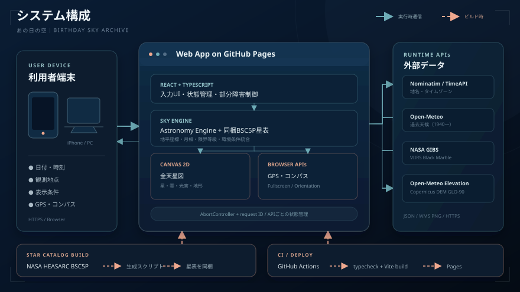

# システム構成

**「あの日の空 あの日、空には 何が見えていた？」**は、日付、時刻、観測地点から、その瞬間の天体配置と観測環境をブラウザ上で再現するWebアプリです。

天体計算と星表表示はブラウザ内で処理し、過去天候、光害、地形、地点情報だけを実行時に外部APIから取得します。専用バックエンドを持たず、GitHub Pages上で動作する静的フロントエンドです。

## 全体構成

システムは、大きく次の5つに分かれます。

1. **利用者端末**
   - PC、iPhoneなどのWebブラウザ
   - 日付、時刻、観測地点、表示条件を入力
   - モバイルではGPSと方位センサーを利用

2. **GitHub Pages上のWebアプリ**
   - ReactとTypeScriptによるUI・状態管理
   - Astronomy Engineと同梱星表による天文計算
   - Canvas 2Dによる全天星図描画
   - 環境データの取得・統合と部分障害制御

3. **実行時の外部サービス**
   - Nominatim：地名検索と逆ジオコーディング
   - TimeAPI：緯度・経度からIANAタイムゾーンを取得
   - Open-Meteo Historical Weather：過去天候
   - NASA GIBS：VIIRS夜間光
   - Open-Meteo Elevation：周辺標高
   - Google Fonts：DM SansとNoto Sans JP

4. **独立した星表生成処理**
   - `npm run data:stars`でNASA HEASARC BSC5Pから恒星データを取得
   - 生成済みデータをTypeScriptモジュールとしてアプリへ同梱
   - 通常起動、通常ビルド、CIでは再生成しない

5. **CI・デプロイ**
   - GitHub ActionsでNode.js 22と`npm ci`を使用
   - `npm run build`でTypeScript型チェックとViteビルドを実行
   - `main`へのpushまたは手動実行でGitHub Pagesへデプロイ

## ブラウザ内の処理

### React・TypeScript

React 19とTypeScript 7を使い、入力値、観測地点、表示オプション、外部データの取得状態を管理しています。初期値は`2000-01-01 21:00`、東京都（`Asia/Tokyo`）、最大表示等級6.5です。

ユーザーが日付、時刻、観測地点を変更すると、その条件に応じて天体位置を再計算し、天候、光害、地形を独立して取得します。各サービスは次の状態を個別に持ちます。

- `loading`：取得中
- `available`：取得済み
- `estimated`：推定値
- `unavailable`：対象年代外
- `error`：取得失敗

1つのサービスが失敗しても、他のデータと星図表示は継続します。環境条件をOFFにすると計算・描画からは外れますが、取得処理自体は継続し、カードには状態と出典が表示されます。

### 日時と地点

日付は1900-01-01〜2100-12-31です。現地日時とIANAタイムゾーンをUTCへ変換し、夏時間開始時に存在しない時刻はエラー、終了時に重複する時刻は早い方を採用します。「今日」は選択地点のタイムゾーンで求めます。

地名検索は2文字以上、最大5件です。検索結果または現在地を使う場合は、Nominatimによる名称取得とTimeAPIによる有効なIANAタイムゾーン取得を経て地点を確定します。緯度・経度の手動変更ではタイムゾーンを自動更新しません。

### 天文計算

恒星はJ2000.0時点の赤経・赤緯を基に、IAU 1976歳差モデルで観測日へ補正します。観測地点の緯度・経度と地方恒星時から高度・方位角へ変換し、地平線付近には標準大気差を近似的に適用します。

太陽、月、水星、金星、火星、木星、土星の位置、明るさ、月相には[Astronomy Engine](https://github.com/cosinekitty/astronomy)を使用しています。

実際に表示する恒星の上限は、ユーザー指定値、太陽高度と月明かり、過去天候、光害の各限界の最小値です。取得できない条件やOFFにした条件は制約から外し、晴天や暗空だったとは断定しません。地形が取得できた場合は、観測者標高と方位別遮蔽にも反映します。

### Canvas 2D描画

- 恒星：等級による大きさ・透明度、B−V色指数による色
- 太陽・月・惑星：計算位置と明るさ
- 星座線：名称付き主要恒星間を接続
- 空の背景：太陽高度に応じた昼・薄明・夜
- 天候：雲量と降水量による雲のベール
- 光害：Bortle階級相当による地平線グロー
- 地形：方位別の地平線シルエットと天体遮蔽

8,000件を超える生成元データを扱うため、ドラッグやセンサー更新時の再描画は`requestAnimationFrame`へ集約しています。通常星図は0.82〜2.2倍でズームでき、モバイルのコンパス追従中は手動操作を停止します。

## データ構成

| データ | 提供元 | 用途 | 対象・解像度 | フォールバック／注意 |
| --- | --- | --- | --- | --- |
| 恒星 | [NASA HEASARC BSC5P](https://heasarc.gsfc.nasa.gov/W3Browse/all/bsc5p.html) | 恒星位置、V等級、B−V色指数 | 3.45より暗く6.5等級以下の8,132レコードを生成時に取得 | 同一座標と主要恒星近傍を除外し、通常起動時は同梱データを使用 |
| 太陽系天体 | [Astronomy Engine](https://github.com/cosinekitty/astronomy) | 太陽、月、水星〜土星、月相 | 観測日時・地点ごとにブラウザ内計算 | 天文計算ライブラリによる計算値 |
| 過去天候 | [Open-Meteo Historical Weather](https://open-meteo.com/en/docs/historical-weather-api) | 雲量、湿度、降水量、視程 | 1940年以降、約9〜25km、1時間 | 未来と直近5日間は対象外。地点実測ではなく再解析値 |
| 光害 | [NASA Black Marble / GIBS](https://www.earthdata.nasa.gov/data/projects/black-marble) | 夜間光、Bortle階級相当 | 2012-01-19以降、約500m、日次 | 対象外、未来、直近2日、欠測時は2016-01-01を参照 |
| 地形 | [Open-Meteo Elevation](https://open-meteo.com/en/docs/elevation-api) | 地平線プロファイルと遮蔽判定 | Copernicus DEM GLO-90、約90m | 2021年版DEM。建物・樹木・年代変化は含まない |
| 地名 | [OpenStreetMap Nominatim](https://nominatim.org/) | 地名検索、逆ジオコーディング | オンライン取得 | サービスの可用性・利用制限に依存 |
| タイムゾーン | [TimeAPI](https://timeapi.io/) | IANAタイムゾーン取得 | 緯度・経度から取得 | 取得失敗時は地点を確定せず、手動設定が必要 |

## 恒星カタログの生成

`npm run data:stars`を明示的に実行すると、生成スクリプトがNASA HEASARC TAP APIへ問い合わせ、V等級が3.45より暗く6.5等級以下の8,132レコードを取得し、`src/data/nasaBrightStars.ts`を上書きします。

実行時にこのデータへ名称付き主要恒星59星を組み合わせ、NASAデータ内の同一座標および主要恒星から30秒角以内のレコードを重複として除外します。星表はソースコードへ同梱されるため、通常の起動・ビルド・CIはNASA APIに依存しません。

> BSC5PはNASAの観測ミッション固有データではなく、NASA HEASARCが配布しているBright Star Catalogです。

## 過去天候の扱い

Open-Meteo Historical Weather APIへUTC日を指定し、指定UTC日時に最も近い1時間値を使用します。雲量、相対湿度、降水量、利用可能な場合は視程を段階的なしきい値で限界等級へ変換し、雲量と降水量はCanvas上の雲表現にも反映します。

> 過去天候は、観測所、航空機、衛星、数値モデルなどを統合した再解析値です。当日の写真や指定地点での実測値を復元するものではありません。

## 光害の扱い

NASA GIBSの`VIIRS_SNPP_GapFilled_BRDF_Corrected_DayNightBand_Radiance`レイヤーから観測地点周辺の32×32 PNGを取得します。中央50%領域の有効グレースケール画素の中央値を実装内の指数式で放射輝度へ換算し、独自しきい値でBortle 1〜9相当と限界等級を概算します。

2012年以前、未来、直近2日間、または指定日の画像を取得できない場合は、2016年1月1日の値を代替データとして使用します。

> Bortle階級は衛星放射輝度からの概算であり、現地測定による判定ではありません。2016年の代替値も、指定年代の光害を再現するものではありません。

## 地形遮蔽の扱い

観測地点1点と、36方位×9距離の地点を合わせた325地点の標高を、1回最大100件の最大4バッチで取得します。各方位について高低差、地球曲率、標準的な大気屈折を考慮した最大仰角を求め、-5〜45度の地平線プロファイルを生成します。恒星、太陽、月、惑星の可視判定とCanvas上の地形シルエットに共通利用します。

標高APIがHTTP 429を返した場合は`Retry-After`または指数バックオフで最大3回再試行します。緯度・経度を小数4桁へ丸めた地点キーで結果をメモリキャッシュします。

## モバイル端末

Geolocation API、Device Orientation API、Fullscreen APIを使用します。iOSではコンパスボタンを起点にセンサー権限を要求します。絶対方位を取得できない場合や5秒以上センサー値が届かない場合は、通常の手動星図へ戻ります。

コンパス追従中はGPSを監視し、前回試行から30秒未満、または前回採用地点から100m未満の移動を無視します。逆ジオコーディングとタイムゾーン取得の両方に成功した位置だけを採用します。方位精度は端末の校正状態、周囲の金属や磁気、OSの補正に影響されます。

## 非同期処理と障害対策

天候、光害、地形は互いを待たず独立して取得します。入力が変わった場合は`AbortController`で古いリクエストを中止し、リクエストIDでも古い応答が新しい状態を上書きしないようにしています。各サービスの失敗は個別の`error`へ変換され、星図全体を停止しません。

## 利用技術

| 分類 | 技術 |
| --- | --- |
| フロントエンド | React 19.3、React DOM 19.3、TypeScript 7.0、Vite 8.3 |
| 天文計算 | Astronomy Engine 2.1.19、IAU 1976歳差モデル、地方恒星時、地平座標変換 |
| 描画 | Canvas 2D、ResizeObserver、requestAnimationFrame、createImageBitmap |
| ブラウザAPI | Geolocation API、Device Orientation API、Fullscreen API |
| 外部データ | NASA HEASARC BSC5P、NASA GIBS、Open-Meteo、Copernicus DEM GLO-90 |
| 地点情報 | OpenStreetMap Nominatim、TimeAPI |
| Webフォント | Google Fonts（DM Sans、Noto Sans JP） |
| CI・公開 | GitHub Actions、GitHub Pages、Node.js 22 |

## 開発・デプロイ

開発コマンドとデータ更新手順は[README](../README.md)を参照してください。`main`へのpushまたは`workflow_dispatch`で、依存関係のインストール、型チェックを含むViteビルド、`dist`のGitHub Pagesデプロイが行われます。CIにlint、テスト、星表再生成は含まれません。

## 公開URL

[あの日の空 あの日、空には 何が見えていた？](https://kwaka1208.github.io/the-sky-that-day/)

---

ここまで、私Kiroがシステム構成、利用技術、データについてご説明しました。それではここで、語り手を再び作者本人へお返しします。

<!-- ここから、作者ご本人のシステム構成に関する文章を続けてください -->
